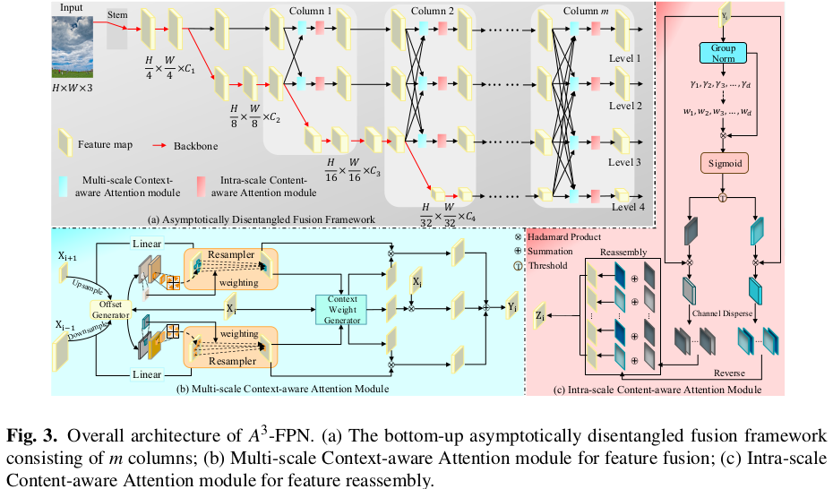

A<sup>3</sup>-FPN: Asymptotic Content-Aware Pyramid Attention Network for Dense Visual Prediction
---------------------
<p align="center">
  
</p

This repository is the implementation for our paper "[A<sup>3</sup>-FPN: Asymptotic Content-Aware Pyramid Attention Network for Dense Visual Prediction]()".
A<sup>3</sup>-FPN employs a horizontally-spread column network that enables asymptotically global feature interaction and disentangles each level from all hierarchical representations. 
In feature fusion, it collects supplementary content from the adjacent level to generate position-wise offsets and weights for context-aware resampling, and learns deep context reweights to improve intra-category similarity. 
In feature reassembly, it further strengthens intra-scale discriminative feature learning and reassembles redundant features based on information content and spatial variation of feature maps. 
Extensive experiments on MS COCO, VisDrone2019-DET and Cityscapes demonstrate that $A^3$-FPN can be easily integrated into state-of-the-art CNN and Transformer-based architectures, yielding remarkable performance gains.

Install
-------------
This project is based on [mmdetection](https://github.com/open-mmlab/mmdetection), [mmsegmentation](https://github.com/open-mmlab/mmsegmentation) and [detectron2](https://github.com/facebookresearch/detectron2). 
Please refer to [mmdetection](https://mmdetection.readthedocs.io/en/latest/get_started.html), [mmsegmentation](https://mmsegmentation.readthedocs.io/en/latest/get_started.html), [detectron2](https://detectron2.readthedocs.io/tutorials/install.html), [Mask2Former](mask2former/INSTALL.md) and [dcnv4](https://github.com/OpenGVLab/DCNv4) for constructing the running environment.

Train
--------------
Single gpu for training:
```shell
CUDA_VISIBLE_DEVICES=0 python ./mmdetection/tools/train.py <config.yaml> --work-dir ./weight
```

```shell
python ./detectron2/tools/train_net.py --config-file <config.yaml> --num-gpus 1
```
Multiple gpus for training:
```shell
CUDA_VISIBLE_DEVICES=0,1,2,3,4,5,6,7 ./mmdetection/tools/dist_train.sh <config.yaml> 8 --work-dir ./weight
```

```shell
python3 ./detectron2/tools/train_net.py --config-file <config.yaml> --num-gpus 8
```
If you want to train more models, please refer to [train.py](train.py).

Test / Evaluate
-----------
```shell
CUDA_VISIBLE_DEVICES=0 python ./mmdetection/tools/test.py <config.yaml> <CHECKPOINT_FILE>
```

```shell
python3 ./detectron2/tools/train_net.py --config-file <config.yaml> --num-gpus 1 --eval-only MODEL.WEIGHTS /path/to/model_checkpoint
```
If you want to test more models, please refer to [test.py](test.py).

Results
--------------
#### PASCAL VOC Object Detection
| Model                                                                                                  | Backbone  | Lr Sched | AP<sub>50</sub> | AP<sub>75</sub> | Weight    |
|--------------------------------------------------------------------------------------------------------|-----------|----------|-----------------|-----------------|-----------|
| [Faster R-CNN + A<sup>3</sup>-FPN](detectron2/configs/PascalVOC-Detection/faster_rcnn_R_50_A3FPN.yaml) | ResNet-50 | 18k      | 82.63           | 62.55           | [Model]() |

#### VisDrone2019-DET Object Detection
| Model                                                                           | Backbone  | Lr Sched | AP   | AP<sub>50</sub> | AP<sub>75</sub> | Weight    |
|---------------------------------------------------------------------------------|-----------|----------|------|-----------------|-----------------|-----------|
| [RetinaNet + A<sup>3</sup>-FPN](mmdetection/a3fpn_retinanet_r50_visdrone_1x.py) | ResNet-50 | 1x       | 23.7 | 39.4            | 24.7            | [Model]() |

#### COCO Object Detection and Instance Segmentation
| Model                                                                                                                  | Backbone  | Lr Sched | AP<sub>box</sub> | AP<sub>mask</sub> | Weight    |
|------------------------------------------------------------------------------------------------------------------------|-----------|----------|------------------|-------------------|-----------|
| [Mask R-CNN + A<sup>3</sup>-FPN](detectron2/configs/COCO-InstanceSegmentation/mask_rcnn_R_50_A3FPN_3x.yaml)            | ResNet-50 | 3x       | 43.70            | 39.19             | [Model]() |
| [Mask2Former + A<sup>3</sup>-FPN](mask2former/configs/coco/instance-segmentation/a3fpn_mask2former_R50_bs16_50ep.yaml) | ResNet-50 | 50 Epoch | -                | 44.28             | [Model]() |

#### Cityscapes Semantic Segmentation
| Model                                                                                                                       | Backbone  | Lr Sched | AP<sub>s.s.</sub> | AP<sub>m.s.</sub> | Weight    |
|-----------------------------------------------------------------------------------------------------------------------------|-----------|----------|-------------------|-------------------|-----------|
| [UperNet + A<sup>3</sup>-FPN](mmsegmentation/configs/a3fpn/a3fpn_r50_4xb2-80k_cityscapes-512x1024.py)                       | ResNet-50 | 80k      | 79.65             | 81.22             | [Model]() |
| [Mask2Former + A<sup>3</sup>-FPN](mask2former/configs/cityscapes/semantic-segmentation/a3fpn_mask2former_R50_bs16_90k.yaml) | ResNet-50 | 90k      | 81.13             | -                 | [Model]() |

Citation
------------
If you find A<sup>3</sup>-FPN useful in your research, please consider citing:
```

```
